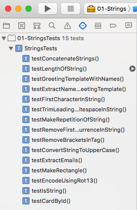
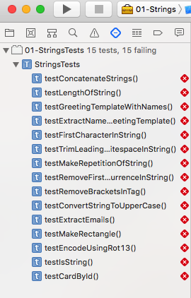
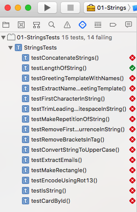

   
# [Brest IT Shark](https://it-shark.pro/)
[](http://it-shark.pro/)
## Swift Assignments

[](https://swift.org)
[](https://opensource.org/licenses/mit-license.php)

The lack of decent Swift training courses across the Internet has inspired us to create this project. The main goal of this project is to cover the basics of Swift language in order to facilitate understanding and learning Swift by trainees and beginners. Assignments are divided in separate projects according to topic in the single workspace.

### To do assignments please follow the next steps:   
*  [Fork this repo](#user-content-how-to-fork-this-repo)
*  [Setup the work environment](#user-content-how-to-setup-work-environment)
*  [Implement assignments](#user-content-implement-assignments)

### How to fork this repo
* Click the **Fork** button at the top-right corner of this page and the repository will be copied to your own account.
* Run `git clone https://github.com/<your-account>/mobile-swift-assignments.git` from command line to download the repo.

### How to setup work environment
Sing in or create your apple ID at https://developer.apple.com. Download and install **Xcode 9.3.x** from https://developer.apple.com/download/more/. You can also download the latest version of Xcode through App Store application on your MacOS.

Open **../Swift-Assignments/Swift-Assignments.xcworkspace** file in Xcode to see all currently available assignments.
Assignments related only to the certain topic are available by opening corresponding **../Swift-Assignments/<##-Project-folder>/<##-Project-Name>.xcodeproj** file in Xcode.

### Implement assignments
Now you are ready to implement assignments. Each task is usually a function:
```swift
    /**
     * Returns the result of concatenation of two strings.
     *
     * Examples:
     *   - "aa", "bb" => "aabb"
     *   - "aa", ""   => "aa"
     *   - "",  "bb"  => "bb"
     */
    public func concat(_ value1: String, with value2: String) -> String {
        return ""
    }
```
* Read the task description in the comment section above the function and try to implement you solution. 
* Run related test (or all the tests) in the Test navigator by pressing 'Run test' button (see the figure below as an example):

<p align="center">
  
</p>

* If your solution is wrong then the test will fail (see the figure below as an example):

<p align="center">
  
</p>

* If your solution is correct then the test will succeed (see the figure below as an example):

<p align="center">
  
</p>

## Contribution
Feel free to contribute to this project. New tasks and topics are appreciated.
